# User Guide: Deploying Streamlit Applications

This guide will walk you through deploying your Streamlit applications using the Rundeck deployment system. No technical knowledge is required - just follow these step-by-step instructions with screenshots.

## Table of Contents
1. [Getting Started](#getting-started)
2. [Deploying Your First Streamlit App](#deploying-your-first-streamlit-app)
3. [Multi-Branch Deployments](#multi-branch-deployments)
4. [Automatic Redeployment](#automatic-redeployment)
5. [System Limitations and Workarounds](#system-limitations-and-workarounds)
6. [Troubleshooting](#troubleshooting)

## Getting Started

### What You Need Before Starting
- A GitHub repository containing your Streamlit application
- Access to the Rundeck deployment system (your administrator will provide the URL)
- Your login credentials (usually provided by your administrator)

### Understanding the Deployment Process
When you deploy a Streamlit app through this system:
1. Your code is automatically pulled from GitHub
2. A container is built with your application
3. The app is deployed to Google Cloud Run
4. You receive a public URL where your app can be accessed
5. Automatic webhooks are set up so future code changes trigger redeployments

## Deploying Your First Streamlit App

### Step 1: Log In to Rundeck

Navigate to your Rundeck URL (provided by your administrator) and log in with your credentials.

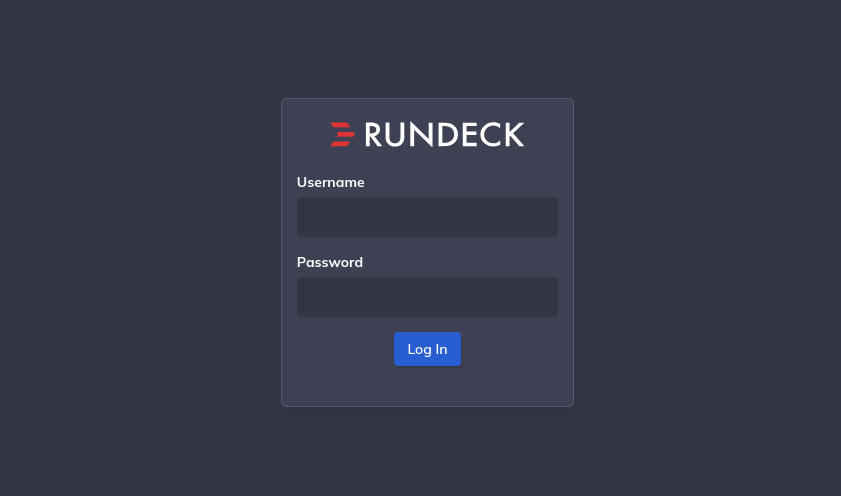

*Enter your username and password, then click "Log In"*

### Step 2: Select Your Project

After logging in, you'll see the project selection page. Click on the **"streamlit-deployments"** project.

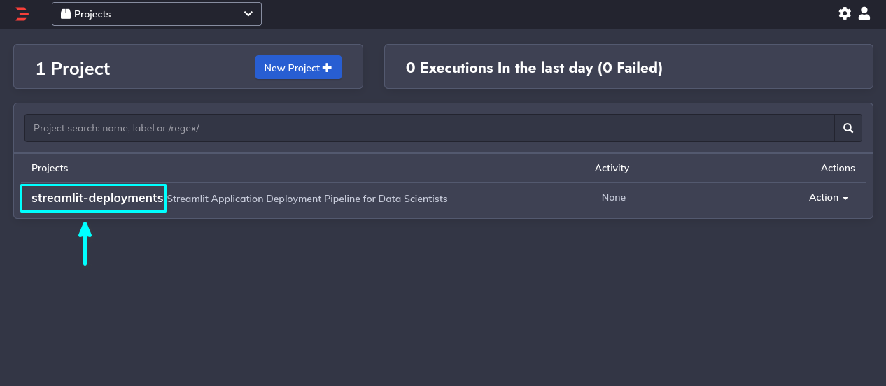

*Click on the streamlit-deployments project to access deployment tools*

### Step 3: Navigate to Jobs

In the project dashboard, click on **"Jobs"** in the left sidebar menu.

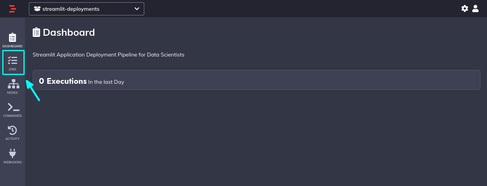

*The Jobs section contains all available deployment operations*

### Step 4: Select the Deployment Job

Find and click on **"Deploy Streamlit App"** from the jobs list.

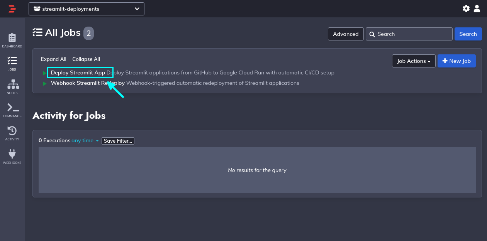

*This job handles the complete deployment process for your Streamlit application*

### Step 5: Fill in Deployment Parameters

You'll now see a form with several fields that need to be completed:

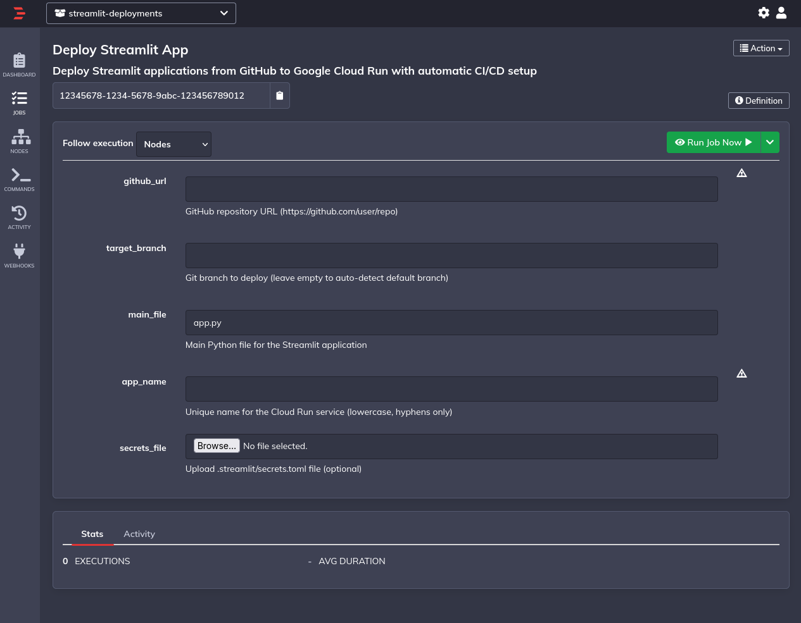

**Required Fields:**

#### GitHub URL
- **What it is**: The web address of your GitHub repository
- **How to get it**: 
  1. Go to your Streamlit app's repository on GitHub
  2. Click the green "Code" button
  3. Copy the HTTPS URL (it should look like `https://github.com/username/repository-name`)

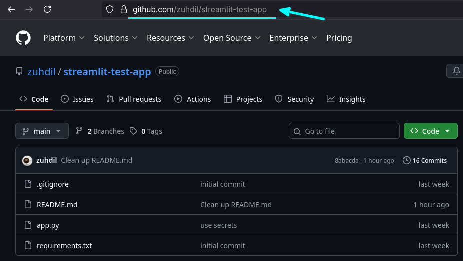

#### Target Branch
- **What it is**: Which version/branch of your code to deploy
- **Default**: Leave blank to automatically use your main branch (usually "main" or "master")
- **Custom**: Enter a specific branch name if you want to deploy a different version

#### Main File
- **What it is**: The name of your main Streamlit file
- **Default**: `app.py` (pre-filled in the form)
- **Other common names**: `main.py`, `streamlit_app.py`
- **How to find it**: Look in your repository for the file that contains `st.` commands

#### App Name
- **What it is**: A unique name for your deployed application
- **Rules**: 
  - Must be lowercase
  - Use hyphens (-) instead of spaces
  - Must be unique (different from any previously deployed apps)
- **Examples**: `sales-dashboard`, `data-analyzer`, `my-first-app`

#### Secrets File (Optional)
- **What it is**: Configuration file for sensitive information like API keys
- **When to use**: Only if your app uses a `.streamlit/secrets.toml` file
- **How to upload**: Click "Browse" and select your secrets.toml file

### Step 6: Run the Deployment

Once all required fields are filled, click the **"Run Job Now"** button.

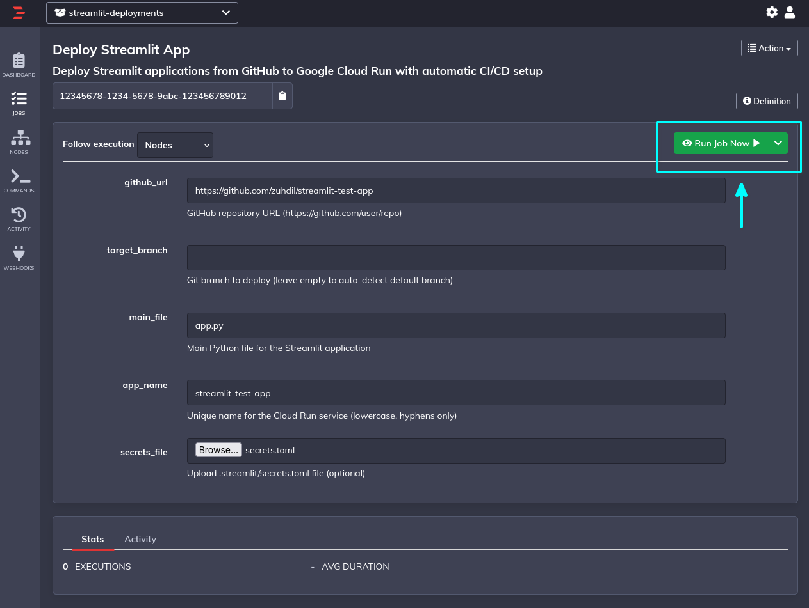

*Example of completed form - your values will be different*

### Step 7: Monitor Deployment Progress

You'll be taken to the job execution page. Click on **"Log Output"** to see the deployment progress in real-time.

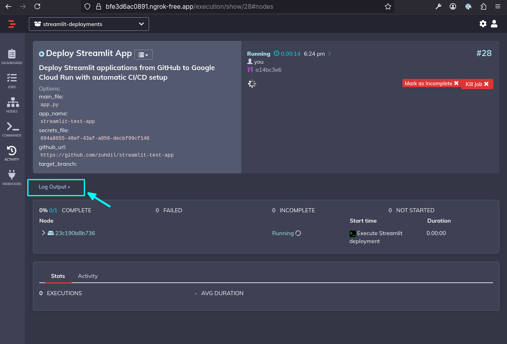

*The log shows each step of the deployment process*

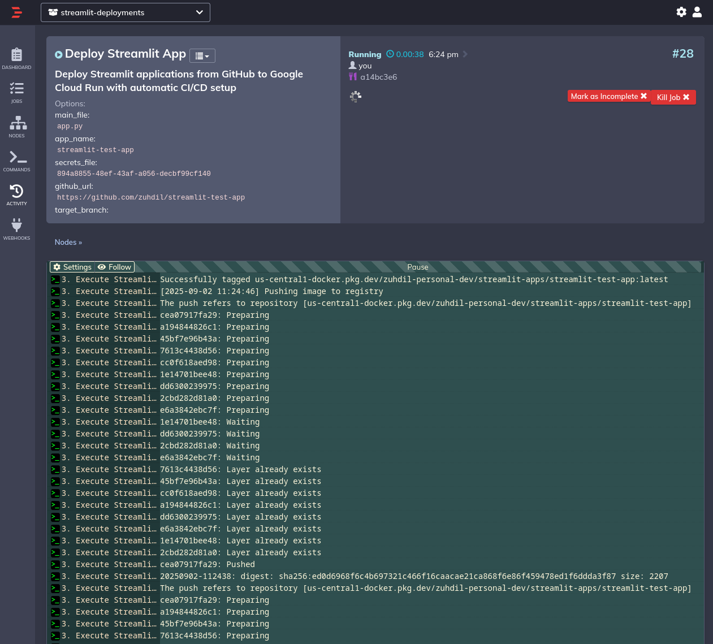

*Watch the log for any errors or status updates*

### Step 8: Get Your Application URL

When the deployment completes successfully, scroll to the bottom of the log output. Your application's public URL will be displayed.

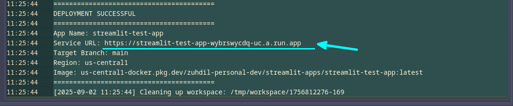

*Copy this URL to access your deployed Streamlit application*

### Step 9: Access Your Deployed App

Copy the URL from the previous step and paste it into your web browser's address bar to open your deployed Streamlit application.

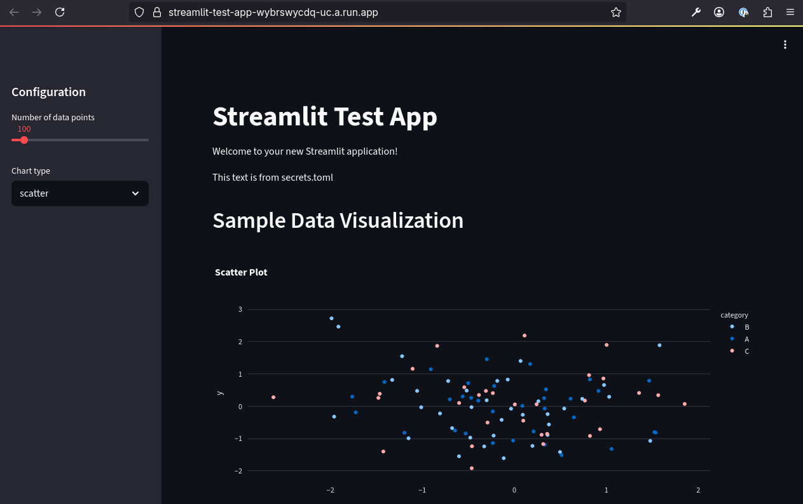

*Your Streamlit app is now live and accessible to anyone with the URL*

### Step 10: Automatic Webhook Setup

The system automatically creates a GitHub webhook during deployment. You can verify this in your GitHub repository under Settings > Webhooks.

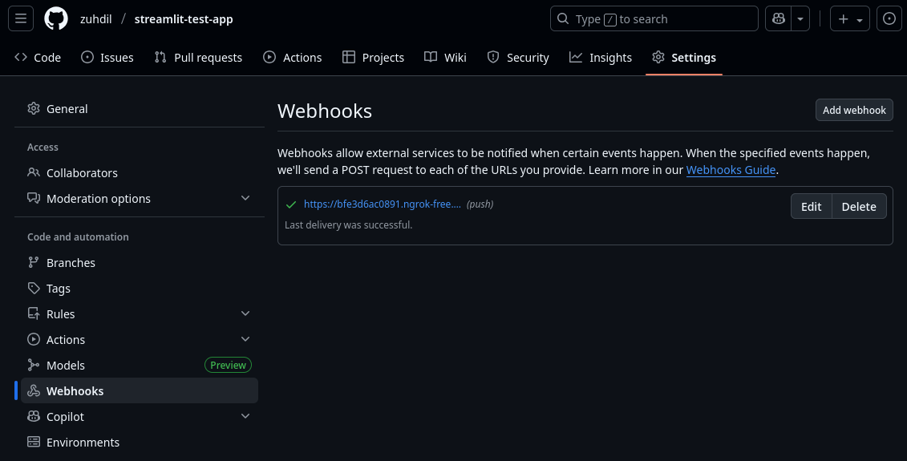

*This webhook enables automatic redeployments when you push code changes*

## Multi-Branch Deployments

You can deploy multiple versions of your app from different branches. This is useful for:
- **Production vs. Staging**: Deploy your main branch as the live app, and a development branch for testing
- **Feature Testing**: Deploy specific feature branches for review before merging
- **A/B Testing**: Run different versions simultaneously

### Example Scenario
- **Repository**: `github.com/company/sales-dashboard`
- **Main Branch**: `main` → **App Name**: `sales-dashboard-prod` → **URL**: `https://sales-dashboard-prod-xyz.run.app`
- **Development Branch**: `develop` → **App Name**: `sales-dashboard-staging` → **URL**: `https://sales-dashboard-staging-xyz.run.app`

### Steps for Multi-Branch Deployment

Follow the same deployment steps as above, but with these important differences:

#### Target Branch Field
Fill in the specific branch name you want to deploy (e.g., `feature/new-charts`, `develop`, `testing`).

#### App Name Field
Use a different name that indicates the branch or purpose:
- Main app: `sales-dashboard`
- Feature branch app: `sales-dashboard-feature-charts`
- Development app: `sales-dashboard-dev`

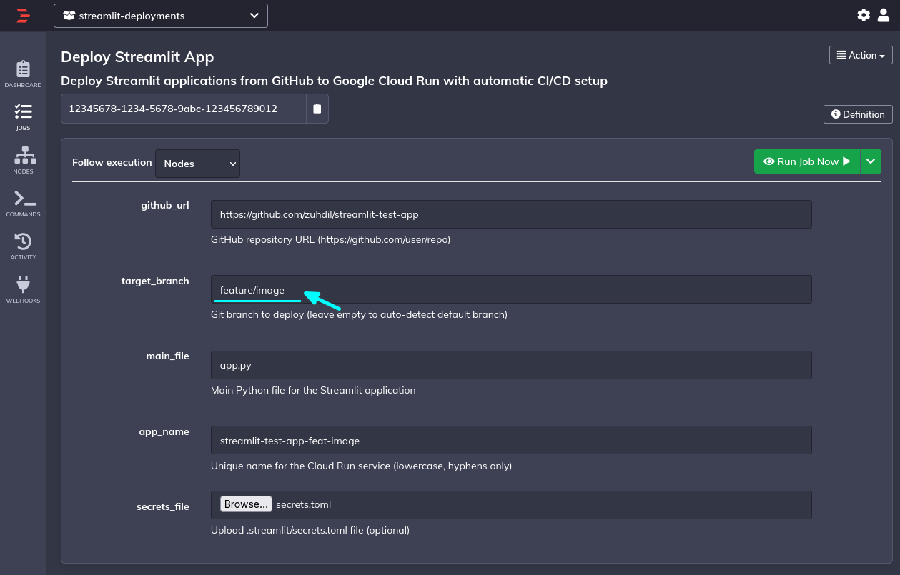

*Example of deploying a feature branch with a descriptive app name*

#### Results
Each branch deployment:
- Creates its own separate Cloud Run service
- Has independent automatic redeployment (webhook monitoring)
- Maintains separate deployment history and logs
- Can be updated independently

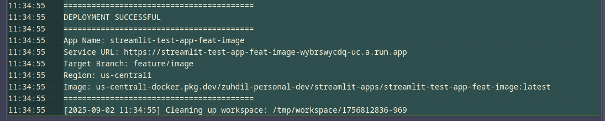

*Each branch gets its own unique URL*

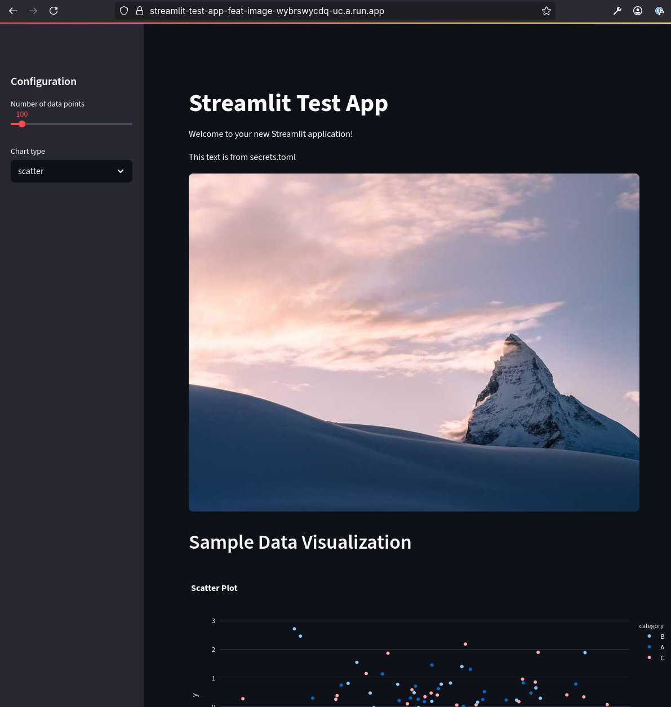

*Your feature branch app running independently from the main app*

## Automatic Redeployment

Once your app is deployed, the system sets up automatic redeployment. Here's how it works:

### What Happens Automatically
1. **GitHub Webhook Creation**: During initial deployment, a webhook is automatically created in your GitHub repository
2. **Code Change Detection**: When you push new code to the deployed branch, GitHub notifies the Rundeck system
3. **Automatic Redeployment**: Rundeck automatically pulls your latest code and redeploys your app
4. **URL Stays the Same**: Your app URL doesn't change - the new version simply replaces the old one

### What This Means for You
- **No Manual Redeployment**: Push code to GitHub, and your app updates automatically
- **Always Current**: Your deployed app always reflects the latest code in the specified branch
- **Multiple Branches**: Each deployed branch has its own automatic redeployment
- **No Downtime**: Updates happen seamlessly in the background

### Timeline
- **Code Push**: You push changes to GitHub
- **Webhook Trigger**: GitHub immediately notifies Rundeck (usually within seconds)
- **Redeployment**: Rundeck begins rebuilding and redeploying (typically 2-5 minutes)
- **Live Update**: Your app is updated with the new code

## System Limitations and Workarounds

### Updating Secrets Files

**Limitation**: Once your app is deployed, there's currently no direct way to update just the secrets file (secrets.toml) without redeploying the entire application.

**When this matters**: If you need to change API keys, database passwords, or other sensitive information in your secrets.toml file after your app is already deployed.

**Workaround**: You'll need to redeploy your entire application with the updated secrets file. Here's how:

#### Steps to Update Secrets:

1. **Prepare your updated secrets.toml file** with the new values
2. **Go back to the Deploy Streamlit App job** (follow Steps 1-4 from the deployment guide)
3. **Fill in the EXACT same parameters** as your original deployment:
   - Same GitHub URL
   - Same target branch
   - Same main file name
   - **Important**: Use the exact same app name as before
4. **Upload your updated secrets.toml file** in the Secrets File field
5. **Run the job** - this will redeploy your app with the new secrets

#### What happens:
- Your existing app will be replaced with the new version
- The same URL will continue to work
- Your app will now use the updated secrets
- The automatic redeployment (webhook) continues to work normally

#### Important notes:
- **Use the same app name**: This ensures your existing app is updated rather than creating a new one
- **Your URL stays the same**: Users can continue using the same link to access your app
- **Brief downtime**: There may be a few minutes where your app is unavailable during the update
- **All parameters must match**: Make sure you use identical settings to avoid creating a duplicate deployment

## Troubleshooting

### Common Issues and Solutions

#### "GitHub URL is not accessible"
- **Problem**: The system can't access your GitHub repository
- **Solution**: Ensure your repository is public, or contact your administrator about private repository access

#### "Main file not found"
- **Problem**: The specified main file doesn't exist in your repository
- **Solution**: Check your repository for the correct file name (e.g., `app.py`, `main.py`)

#### "App name already exists"
- **Problem**: You're trying to use an app name that's already been used
- **Solution**: Choose a different, unique app name

#### "Deployment failed during build"
- **Problem**: Your app has missing dependencies or code errors
- **Solutions**:
  - Ensure your repository has a `requirements.txt` file with all needed packages
  - Test your app locally before deploying
  - Check the deployment log for specific error messages

#### "Secrets file upload failed"
- **Problem**: Issue with your secrets.toml file
- **Solutions**:
  - Ensure the file is properly formatted TOML
  - Check that the file size isn't too large
  - Verify the file contains valid configuration

#### "App is deployed but not loading"
- **Problem**: The app URL works but shows errors
- **Solutions**:
  - Check that your main file is a valid Streamlit app
  - Ensure all imports and dependencies are available
  - Verify any external services (APIs, databases) are accessible

### Getting Help

If you encounter issues not covered here:

1. **Check the Logs**: Always review the deployment log output for specific error messages
2. **Test Locally**: Make sure your Streamlit app works on your local machine first
3. **Contact Support**: Reach out to your system administrator with:
   - The exact error message from the logs
   - Your GitHub repository URL
   - The parameters you used for deployment

### Best Practices

#### Before Deploying
- Test your Streamlit app locally (`streamlit run app.py`)
- Ensure you have a complete `requirements.txt` file
- Verify your secrets.toml file (if used) has the correct format
- Choose a descriptive, unique app name

#### Repository Organization
- Keep your main Streamlit file in the root directory when possible
- Use clear, descriptive file names
- Include a README.md explaining what your app does

#### Naming Conventions
- **App Names**: Use descriptive names like `sales-report-2024`, `customer-analytics`
- **Branch Names**: Use clear names like `feature/new-dashboard`, `hotfix/chart-bug`

#### Managing Multiple Deployments
- Keep a list of your deployed apps and their URLs
- Use consistent naming patterns for related apps
- Clean up old/unused deployments by contacting your administrator

---

**Need More Help?**
- Review the deployment logs for detailed error information
- Test your application locally before deploying
- Contact your system administrator for technical support
- Keep this guide handy for reference during deployments